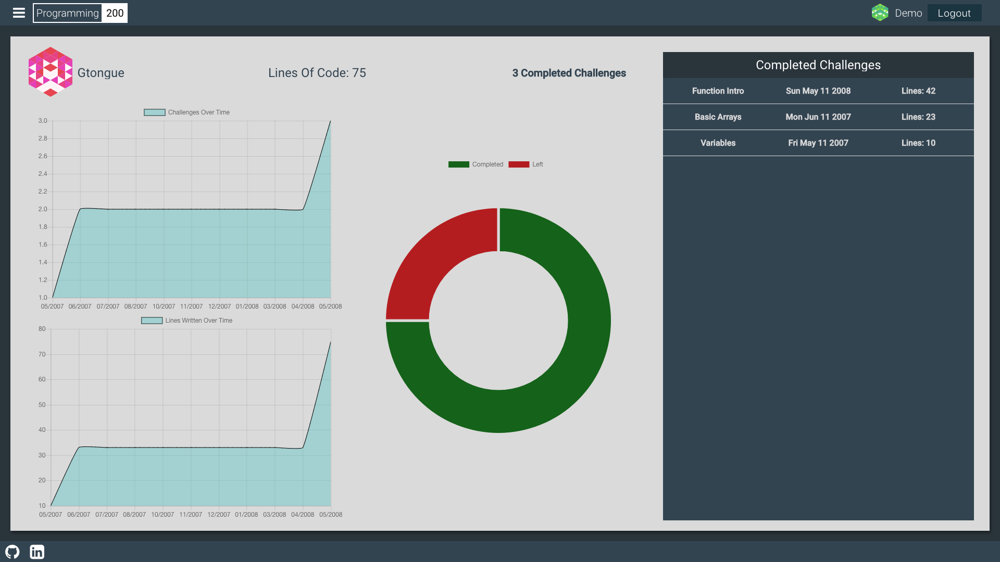

# README

# [Programming200](http://programming200.com)


Programming 200 is a full-stack web applicaiton that takes inspirtation from codecademy, codewars, and codefights. The app allows users to take programming challenges and track their progress. The backend is using Ruby of Rails 5.1.4 with a PostgreSQL database. The frontend is using React Redux. 

# Why Rails and React/Redux?
- This project was created completely in two weeks meaning I had to pick what technologies I was going to use very carefully. Rails is built in such a way that it was perfect for this project. Powerful and very quick to get up and running. 

- React/Redux was the obvious choice for frontend. The constant one state in a project such as this allows for much easier database access and state management. On top of that having the automatic re-rendering of components when their state changes or they receive new props is an incredibly powerful tool that allows quick a robust development.

# Features
## Home Page
- Hamburger Menu
- Recent Challenges Feed


## User Show Page
- Graphs of user's progress
- List of completed challenges



## Challenge Index Page
- List of all challenges with user's progress
- Live searchbar


## User Authentication


## Challenge Workspace
- Code editor with execution
- Terminal
- Tests


# Challenges
## Executing user inputed javascript
This was the largest challenge to overcome in this project. Instead of using an outside service I wanted to do the execution in vanilla javascript. 
- The first challenge I faced when implementing this feature was making sure that the user didn't have access to local variables defined in the react component that the code editor is defined. The solution to this ended up being very simple. After a lot of trial and error I ended up injecting "use strict" into the first line of the users code to isolate the scope and declaring a new Function using that code. I then run that function on a seperate thread using npm-threads to make the UX smooth.

- The next challenge was figuring out the best way to intercept console log statements. Once again after many different anlge I settled on overwriting the console log function before running their function. This allows me to store a response string that once their code is finished running I can dispatch to my terminal.

- I then needed to then implement a testing library. I dealt with this in a similar way to the first challenge. I write the tests in plain javascript and then inject them to be run at the end of the users code. I also had to make sure to place my testing library function on the window so that the users function could have access to it.

- The last feature I had to program to finish the code execution was error handling. The three types of errors I wanted to handle were infinite loops, infinite recursion, and ilegal javascript. I handle infinite loops by, once again, using code injection. Using regex I insert a counter variable and increment it everytime a loop iterates. If this counter gets above 100,000 I throw a possible infinite loop error. I handle the other two with a simple try/catch statement.


```javascript
const formatCode = code => {
  code = '"use strict" \n' + code;
  code = "let loopCountingVariable = 0;" + code;
  code = code.replace(/for/g, "loopCountingVariable = 0;for");
  code = code.replace(/while/g, "loopCountingVariable = 0;while");
  code = code.replace(/{/g, "{loopCountingVariable+=1; if(loopCountingVariable > 100000) {throw `Possible infinite loop`;}");
  return code;
};

const formatTest = code => {
  return code.replace(/Testing./g, "window.programming200env.testing.testingLibrary.");
};

export const testCodeAsync = (codeString, testString) => {
  runCodeAsync(codeString + formatTest(";" + testString));
};

export const runCodeAsync = (codeString) => {
  let thread = spawn((input, done) => {
    done({code: input.code, output: input.output});    
  });
  thread.send({
    code: codeString,
    output: ""
  }).on('message', (response) => {
    if(response.code)
    {
      let consoleLog = console.log;
      let code = formatCode(response.code);
      console.log = (...strings) => {
        for(let i = 0; i < strings.length; i++)
        { 
          response.output += "=>  " + strings[i] + "\n";
        }
      };
      try{
        new Function(code)();
      }catch(error){
        window.programming200env.logError(error.toString());
      }
      response.code = "";
      console.log = consoleLog;
    }
    if(response.output){
      if(window.programming200env && window.programming200env.logTerminal){
        window.programming200env.logTerminal(response.output);
        response.output = "";
      }else{
        console.log(response.output);
      }
    }
    thread.kill();
  });
};
```


# Plans
- Expand the number of languages supported (ruby, css, html). Possibly by using Amazon's lambda service
- Expand the number of challenges to 50+
- More extensive testing library
- More efficient terminal output and error handling